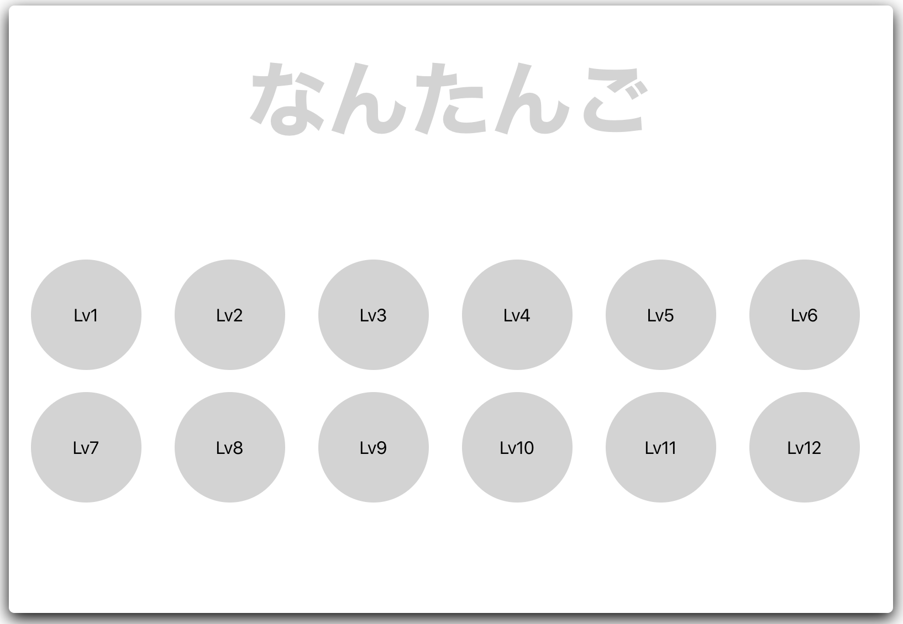

# Nantango

Learning app to write down 5 English words you haven't remembered

## Screens

| Top | Quiz | Result |
|:---:|:---:|:---:|
||||


## Start the application server

```bash
$ npm run start
```

## Build and deploy the app

```bash
npx ng build --prod --base-href "https://t-cool.github.io/nantango/"
npx angular-cli-ghpages --dir=dist
```

## Demo

[https://gdg-nara.github.io/nantango/](https://gdg-nara.github.io/nantango/)


## License

MIT
